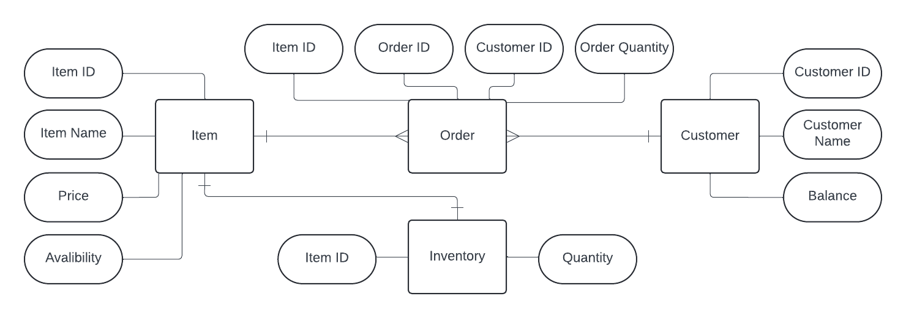

# inventory-management-system

This project includes X sections

## section 1: ER Diagram design

### Resources Description
1. Item: Describes the relations and attributes a product in the system has. 
    Attributes: 
    - Item ID: PK, Identifies Items Uniquly
    - Item Name: Describes Items
    - Item Price: Gives Value TO Items
    - Item Avalibility: Evaluates If The Item Can Be Ordered
2. Inventory: Describes the inventory management of the products in the system, including its quantity. 
    Attributes: 
    - Item ID: PK, FK, Identifies Items In Inventory Uniquly
    - Quantity: Declears The Avalible Quantity Of An Item
3. Customer: Describes the relations and attriburs customers have in the system. 
    Attributes: 
    - Customer ID: PK, Identifies Customers Uniquly
    - Customer Name: Naming Customers
    - Balance: Describes How Much Money Customers Deposited In Their Account
4. Order: Manages the relationship between customers and products as an order. 
    Attributes: 
    - Order ID: PK, Identifies Orders Uniquly
    - Customer ID: FK, Identifies Customers Ordering
    - Item ID: FK, Identifies Items Ordered
    - Order Quantity: Evaluates The Quantity Of The Ordered Item
### Resources Relationships
Inventory <-> Item: One to One, as if each item has one entery in the inventory. 
Item <-> Order: One to Many, as if each item Can be Ordered Many Times. 
Customer <-> Order: One to Many, as if each customer can Make Many orders. 
## Section 2: Description of each ER resource methods

## section 3: OpenAI specification Design

Section X: Coming SOON